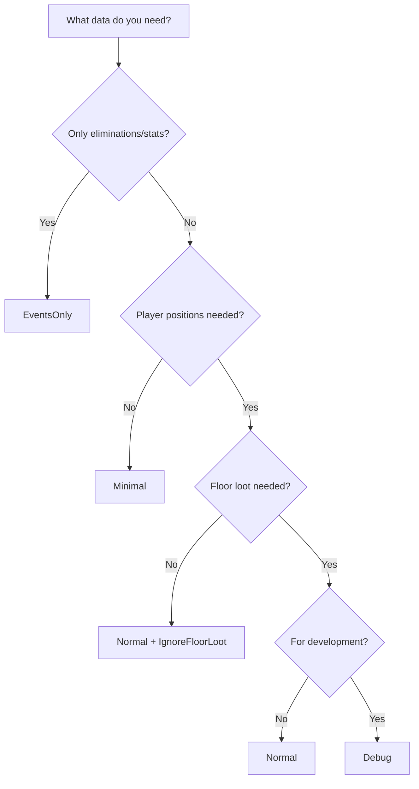

Parse types allow you to balance between parsing speed and data completeness. Different modes control which parts of the replay are processed, letting you optimize for your specific use case.

## Available Parse Types

The `ParseType` enum defines five parsing modes, each building upon the previous level:

```csharp
public enum ParseType
{
    EventsOnly,  // Parses only events
    Minimal,     // Parses events and initial game state
    Normal,      // Parses events and full game state
    Full,        // Parses everything currently handled
    Debug        // Parses everything + debugging information
}
```

Defined in `Unreal.Core/Models/Enums/ParseType.cs:3-25`.

## EventsOnly

**Use Case:** Fast extraction of eliminations and match statistics

```csharp
var reader = new ReplayReader();
var replay = reader.ReadReplay("match.replay", ParseType.EventsOnly);

// Available data:
// - replay.Eliminations
// - replay.Stats
// - replay.TeamStats
```

**What's Parsed:**
- Player eliminations with locations and weapons
- Match statistics (damage, accuracy, materials)
- Team statistics (placement, team size)
- Encryption key events

**What's Skipped:**
- All ReplayData chunks (network packets)
- Player positions over time
- Building placements
- Inventory changes

<Tip>
`EventsOnly` is **10-50x faster** than Normal parsing and ideal for leaderboards, elimination feeds, or match statistics.
</Tip>

## Minimal

**Use Case:** Events plus basic game state information

```csharp
var replay = reader.ReadReplay("match.replay", ParseType.Minimal);

// Available data:
// - Everything from EventsOnly
// - replay.GameInformation.GameState
// - replay.GameInformation.PlayerStates
// - Supply drops and llamas
```

**What's Parsed:**
- All events (same as EventsOnly)
- ReplayData chunks are processed
- Game state (match info, playlist)
- Player states (names, teams, eliminations)
- Safe zone updates
- Supply drops and llamas
- Critical game objects

**What's Skipped:**
- Player pawn updates (positions)
- Floor loot pickups
- Most network channels stop parsing early

### Channel Parsing Behavior

The `ContinueParsingChannel()` method in `FortniteReplayReader.cs:200-220` controls which actors are fully parsed:

```csharp
protected override bool ContinueParsingChannel(INetFieldExportGroup exportGroup)
{
    switch (exportGroup)
    {
        // Always fully parse these
        case SupplyDropLlamaC _:
        case SupplyDropC _:
        case SafeZoneIndicatorC _:
        case FortPoiManager _:
        case GameStateC _:
            return true;
    }

    switch (ParseType)
    {
        case ParseType.Minimal:
            return false;  // Stop parsing other channels
        default:
            return true;
    }
}
```

<Note>
Certain actors (game state, supply drops, safe zones) are **always** fully parsed regardless of parse type because they're critical for understanding match context.
</Note>

## Normal

**Use Case:** Complete match replay with player tracking

```csharp
var replay = reader.ReadReplay("match.replay", ParseType.Normal);

// Available data:
// - Everything from Minimal
// - Player positions throughout the match
// - Floor loot spawns and pickups
```

**What's Parsed:**
- All events
- All ReplayData chunks fully processed
- Player pawn updates (positions/rotations)
- Floor loot pickups
- Continuous player tracking

**What's Still Conditional:**

Some features can be disabled even in Normal mode via `FortniteReplaySettings`:

```csharp
var settings = new FortniteReplaySettings
{
    IgnoreFloorLoot = true,      // Skip floor loot even in Normal mode
    IgnoreShots = true,          // Skip batched damage events
    IgnoreInventory = true,      // Skip inventory updates
    IgnoreHealth = true,         // Skip health updates
    IgnoreContainers = true      // Skip container interactions
};

var reader = new ReplayReader(settings: settings);
var replay = reader.ReadReplay("match.replay", ParseType.Normal);
```

See the conditionals in `OnExportRead()` at `FortniteReplayReader.cs:134-197`:

```csharp
case PlayerPawnC playerPawn:
    if (ParseType >= ParseType.Normal)
    {
        Replay.GameInformation.UpdatePlayerPawn(channel, playerPawn);
    }
    break;

case FortPickup fortPickup:
    if (ParseType >= ParseType.Normal)
    {
        if (!_fortniteSettings.IgnoreFloorLoot)
        {
            Replay.GameInformation.UpdateFortPickup(channel, fortPickup);
        }
    }
    break;
```

## Full

**Use Case:** Maximum data extraction for analysis

```csharp
var replay = reader.ReadReplay("match.replay", ParseType.Full);
```

**What's Parsed:**
- Everything from Normal mode
- All currently implemented actor types
- All network replication data

<Note>
`Full` mode doesn't currently add features beyond `Normal`, but is reserved for future enhancements.
</Note>

## Debug

**Use Case:** Development and troubleshooting

```csharp
var logger = LoggerFactory.Create(builder => builder.AddConsole()).CreateLogger<ReplayReader>();
var reader = new ReplayReader(logger: logger);
var replay = reader.ReadReplay("match.replay", ParseType.Debug);
```

**What's Parsed:**
- Everything from Full mode
- Debug logging for unknown properties
- Verbose parsing information
- Channel debugging data

**Additional Debug Output:**
- Unknown actor types logged as warnings
- Missing ClassNetCache information
- Property parsing failures
- Network channel state

See `ReceivedReplicatorBunch()` at `ReplayReader.cs:1500`:

```csharp
if (ParseType == ParseType.Debug)
{
    _logger?.LogDebug($"Couldn't find ClassNetCache for {netFieldExportGroup?.PathName}");
}
```

## Performance Comparison

Parse times for a typical 20-minute Fortnite match:

<AccordionGroup>
  <Accordion title="EventsOnly - ~100ms">
    - Only parses event chunks
    - Skips all ReplayData processing
    - Best for elimination feeds and statistics
  </Accordion>
  
  <Accordion title="Minimal - ~2-3 seconds">
    - Processes ReplayData but stops parsing most channels early
    - Good balance of speed and data
    - Ideal for match summaries
  </Accordion>
  
  <Accordion title="Normal - ~5-10 seconds">
    - Fully parses player positions and game state
    - Required for replay visualization
    - Standard mode for most applications
  </Accordion>
  
  <Accordion title="Full/Debug - ~10-15 seconds">
    - Maximum data extraction
    - Additional logging overhead in Debug mode
    - Use for comprehensive analysis
  </Accordion>
</AccordionGroup>

<Warning>
Parse times vary significantly based on:
- Match duration (longer matches = more data)
- Number of players (100 player modes vs 16 player modes)
- Replay file size
- Disk I/O speed
</Warning>

## Choosing the Right Parse Type

Use this decision tree to select the appropriate parse type:



## Example Usage

### Quick Statistics

```csharp
// Parse only events for fast statistics
var replay = reader.ReadReplay("match.replay", ParseType.EventsOnly);

var avgDistance = replay.Eliminations
    .Where(e => e.ValidDistance)
    .Average(e => e.Distance);

Console.WriteLine($"Average elimination distance: {avgDistance:F1}m");
Console.WriteLine($"Total damage dealt: {replay.Stats?.WeaponDamage}");
```

### Match Summary

```csharp
// Use Minimal for game state without heavy processing
var replay = reader.ReadReplay("match.replay", ParseType.Minimal);

Console.WriteLine($"Map: {replay.GameInformation.GameState?.MapName}");
Console.WriteLine($"Players: {replay.GameInformation.PlayerStates.Count}");
Console.WriteLine($"Winner: {replay.GameInformation.GetWinner()?.PlayerName}");
```

### Full Replay Analysis

```csharp
// Use Normal for complete player tracking
var settings = new FortniteReplaySettings
{
    IgnoreFloorLoot = true  // Skip loot if not needed
};

var reader = new ReplayReader(settings: settings);
var replay = reader.ReadReplay("match.replay", ParseType.Normal);

// Track player positions over time
foreach (var playerState in replay.GameInformation.PlayerStates)
{
    var positions = replay.GameInformation.GetPlayerPositions(playerState.Key);
    Console.WriteLine($"{playerState.Value.PlayerName} moved {CalculateDistance(positions)}m");
}
```

## Related Concepts

<CardGroup cols={2}>
  <Card title="Replay Structure" icon="diagram-project" href="/concepts/replay-structure">
    Understand what data is available in each chunk type
  </Card>
  <Card title="Quick Start" icon="rocket" href="/quickstart">
    See parse types in action with complete examples
  </Card>
</CardGroup>