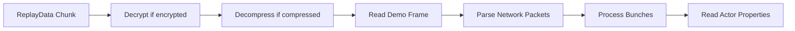

Fortnite replay files follow Unreal Engine's replay system architecture. Understanding this structure is essential for effectively parsing and extracting data from replay files.

## File Structure Overview

A Fortnite replay file consists of several key components organized into chunks:

```
┌─────────────────────┐
│   Replay Info       │  File metadata and encryption info
├─────────────────────┤
│   Header Chunk      │  Network versions and game info
├─────────────────────┤
│   Event Chunks      │  Eliminations, stats, zones
├─────────────────────┤
│   ReplayData Chunks │  Network packets (game state)
├─────────────────────┤
│ Checkpoint Chunks   │  Saved game states (optional)
└─────────────────────┘
```

## Replay Info

The replay file starts with metadata about the recording itself. This is read first via `ReadReplayInfo()` in `ReplayReader.cs:536`.

```csharp
public class ReplayInfo
{
    public uint LengthInMs { get; set; }
    public uint NetworkVersion { get; set; }
    public uint Changelist { get; set; }
    public string FriendlyName { get; set; }
    public DateTime Timestamp { get; set; }
    public bool IsLive { get; set; }
    public bool IsCompressed { get; set; }
    public bool Encrypted { get; set; }
    public byte[] EncryptionKey { get; set; }
}
```

**Key Properties:**
- `LengthInMs` - Total replay duration in milliseconds
- `Encrypted` - Whether the replay requires decryption
- `IsCompressed` - Whether data chunks are compressed
- `EncryptionKey` - AES encryption key for encrypted replays

## Replay Header

The header chunk contains versioning information crucial for parsing the replay correctly. Read via `ReadReplayHeader()` in `FortniteReplayReader.cs:227`.

```csharp
public class ReplayHeader
{
    public NetworkVersionHistory NetworkVersion { get; set; }
    public uint NetworkChecksum { get; set; }
    public EngineNetworkVersionHistory EngineNetworkVersion { get; set; }
    public uint GameNetworkProtocolVersion { get; set; }
    public string Branch { get; set; }  // e.g., "++Fortnite+Release-28.00"
    public ushort Major { get; set; }   // Season number
    public ushort Minor { get; set; }   // Version within season
}
```

<Note>
The `Branch` property is parsed to extract `Major` and `Minor` version numbers, which are critical for handling format differences between Fortnite seasons.
</Note>

## Event Chunks

Events contain high-level game information that doesn't require parsing network packets. Events are read via `ReadEvent()` in `FortniteReplayReader.cs:238`.

### Available Events

<CardGroup cols={2}>
  <Card title="Player Eliminations" icon="crosshairs">
    Tracks all eliminations with location, weapon, and distance data.
  </Card>
  <Card title="Match Stats" icon="chart-line">
    End-game statistics including damage, accuracy, and materials.
  </Card>
  <Card title="Team Stats" icon="users">
    Final placement and team information.
  </Card>
  <Card title="Encryption Key" icon="key">
    Player state encryption keys for protected replays.
  </Card>
</CardGroup>

### Event Structure

Every event follows this base structure from `EventInfo.cs`:

```csharp
public class EventInfo
{
    public string Id { get; set; }
    public string Group { get; set; }       // Event type identifier
    public string Metadata { get; set; }    // Additional type info
    public uint StartTime { get; set; }     // Event timestamp (ms)
    public uint EndTime { get; set; }
    public int SizeInBytes { get; set; }    // Payload size
}
```

### Example: Player Elimination Event

Eliminations are the most commonly parsed events:

```csharp
public class PlayerElimination : BaseEvent
{
    public PlayerEliminationInfo EliminatedInfo { get; set; }
    public PlayerEliminationInfo EliminatorInfo { get; set; }
    public EDeathCause DeathCause { get; set; }  // Weapon used
    public uint Timestamp { get; set; }          // Time of elimination
    public bool Knocked { get; set; }            // Knocked vs eliminated
}
```

See `FortniteReplayReader.cs:262-266` for the elimination parsing implementation.

### Example: Match Stats Event

Contains end-game player statistics:

```csharp
public class Stats : BaseEvent
{
    public uint Eliminations { get; set; }
    public float Accuracy { get; set; }
    public uint Assists { get; set; }
    public uint WeaponDamage { get; set; }
    public uint DamageToStructures { get; set; }
    public uint MaterialsGathered { get; set; }
    public uint TotalTraveled { get; set; }
}
```

Parsed in `FortniteReplayReader.cs:360-383`.

## ReplayData Chunks

ReplayData chunks contain the network packets that represent the actual game state over time. These are read via `ReadReplayData()` in `ReplayReader.cs:387`.

**What ReplayData Contains:**
- Player positions and movements
- Building placements and edits
- Weapon fire and inventory changes
- Vehicle interactions
- Game state updates (storm, supply drops)

<Warning>
ReplayData chunks require significantly more processing than events. Use [parse types](/concepts/parse-types) to control the level of detail parsed.
</Warning>

### Network Packets Flow



## FortniteReplay Model

The complete parsed replay is represented by the `FortniteReplay` class:

```csharp
public class FortniteReplay : Replay
{
    public ReplayInfo Info { get; set; }                        // File metadata
    public ReplayHeader Header { get; set; }                    // Version info
    public IList<PlayerElimination> Eliminations { get; set; }  // All eliminations
    public Stats Stats { get; set; }                            // Match statistics
    public TeamStats TeamStats { get; set; }                    // Team placement
    public GameInformation GameInformation { get; set; }        // Game state data
}
```

### Accessing Parsed Data

```csharp
var reader = new ReplayReader();
var replay = reader.ReadReplay("match.replay", ParseType.Minimal);

// Access header information
Console.WriteLine($"Fortnite v{replay.Header.Major}.{replay.Header.Minor}");
Console.WriteLine($"Match Duration: {replay.Info.LengthInMs}ms");

// Access events
Console.WriteLine($"Total Eliminations: {replay.Eliminations.Count}");
foreach (var elim in replay.Eliminations)
{
    Console.WriteLine($"{elim.Eliminator} eliminated {elim.Eliminated} at {elim.Time}");
}

// Access match stats
if (replay.Stats != null)
{
    Console.WriteLine($"Damage Dealt: {replay.Stats.WeaponDamage}");
    Console.WriteLine($"Accuracy: {replay.Stats.Accuracy:P}");
}
```

## Chunk Processing Order

The replay reader processes chunks in the order they appear in the file (see `ReadReplayChunks()` in `ReplayReader.cs:156`):

1. **Replay Info** - Always read first to check encryption/compression
2. **Header** - Read to establish network versions for parsing
3. **Events/ReplayData** - Read in file order
4. **Checkpoints** - Currently skipped in this implementation

<Tip>
Events can be parsed quickly without processing ReplayData chunks. Use `ParseType.EventsOnly` when you only need eliminations and statistics.
</Tip>

## Related Concepts

<CardGroup cols={2}>
  <Card title="Parse Types" icon="sliders" href="/concepts/parse-types">
    Control how much of the replay structure is parsed
  </Card>
  <Card title="Encryption" icon="lock" href="/concepts/encryption">
    Learn about encrypted replay handling
  </Card>
</CardGroup>